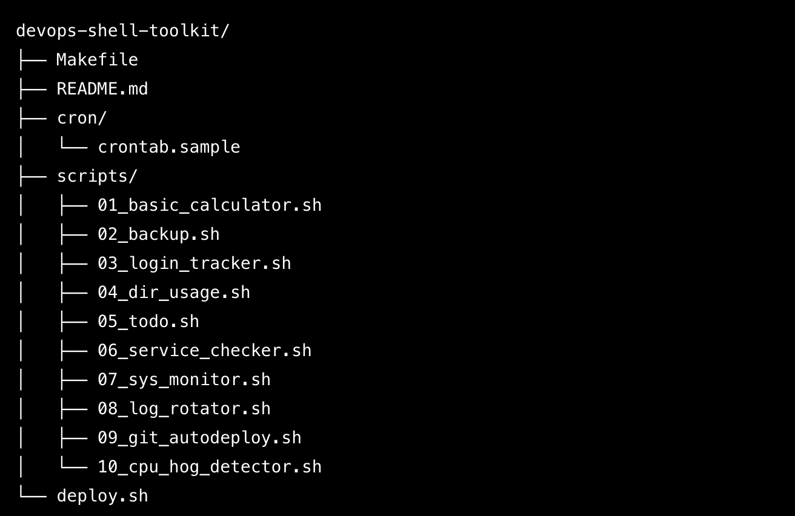

# DevOps Shell Scripting Student Toolkit

Welcome! This repo includes 10 shell scripting mini-projects from beginner to intermediate.

## Projects List

| ID | Script                      | Skills Covered                          |
|----|-----------------------------|-----------------------------------------|
| 01 | Basic Calculator            | `read`, `case`, arithmetic              |
| 02 | Backup Script               | `tar`, `date`, backups                  |
| 03 | User Login Tracker          | `grep`, `awk`, logs                     |
| 04 | Directory Usage Report      | `du`, `sort`, disk usage                |
| 05 | Simple To-Do List           | `while`, files, array logic             |
| 06 | Service Health Checker      | `systemctl`, status monitoring          |
| 07 | System Resource Monitor     | `top`, `free`, CSV export               |
| 08 | Log Rotator                 | file handling, `gzip`, timestamps       |
| 09 | Git Auto-Deploy             | `git`, loop, change detection           |
| 10 | CPU Hog Detector            | `ps`, `awk`, alert on CPU spike         |

## Project Structure:

